# Cafe POS System

A modern, JavaFX-based Point of Sale (POS) system designed specifically for cafes, featuring user management, menu handling, order processing, loyalty cards, and social table ordering capabilities.

## Features

- **User Management**: Secure user authentication and registration with role-based access (USER/ADMIN)
- **Menu Management**: Comprehensive menu item and category management with images and ingredients
- **Order Processing**: Intuitive cart system with order tracking and status management
- **Loyalty Program**: Integrated loyalty cards with bonus accumulation and redemption
- **Social Tables**: Support for shared ordering at social tables
- **Modern UI**: Clean, responsive interface built with JavaFX and Atlantafx themes
- **Database**: SQLite-based storage with connection pooling via HikariCP

## Technologies Used

- **Java 24** (with preview features enabled)
- **JavaFX 22** for the user interface
- **SQLite** for data persistence
- **HikariCP** for database connection pooling
- **SLF4J** for logging
- **Maven** for build management
- **Atlantafx** and **ControlsFX** for enhanced UI components

## Prerequisites

- Java 24 JDK (with preview features support)
- Maven 3.6+

## Installation

1. Clone the repository:
   ```bash
   git clone https://github.com/Sashka11111/social-pos-terminal.git
   cd cafe-pos-system
   ```

2. Build the project:
   ```bash
   mvn clean compile
   ```

3. Run the application:
   ```bash
   mvn javafx:run
   ```

Alternatively, you can run the pre-built JAR or executable files located in the project root:

- Run the JAR:
  ```bash
  java -jar cafepossystem.jar
  ```

- Or use the Windows executable:
  ```bash
  cafepossystem.exe
  ```

## Screenshots

| Login Screen | Registration Screen | Main Menu |
|--------------|----------------------|-----------|
|  | 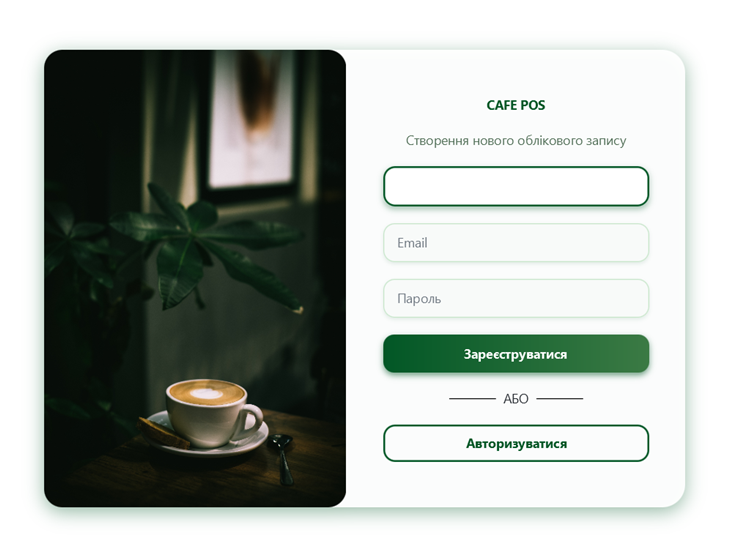 | 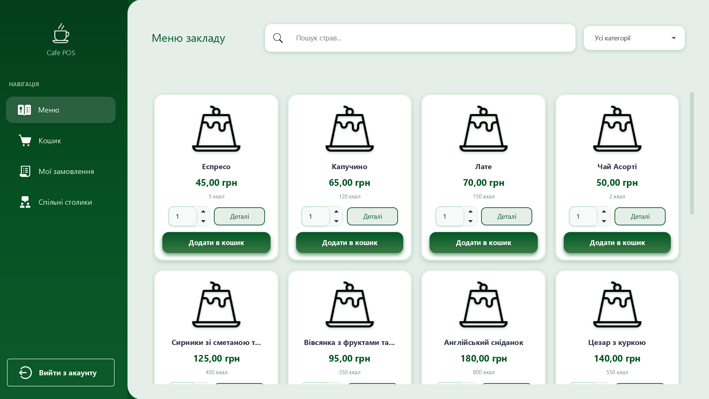 |

| Admin Menu                                | Menu Item Details | Shopping Cart |
|-------------------------------------------|-------------------|---------------|
| 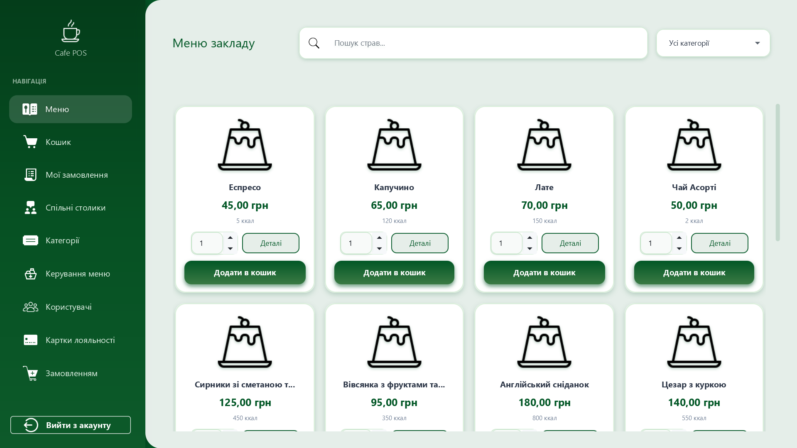 | 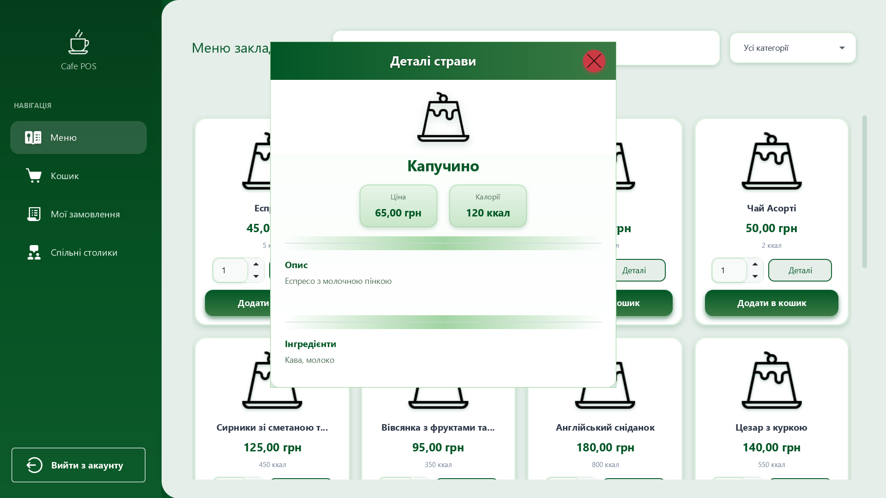 | 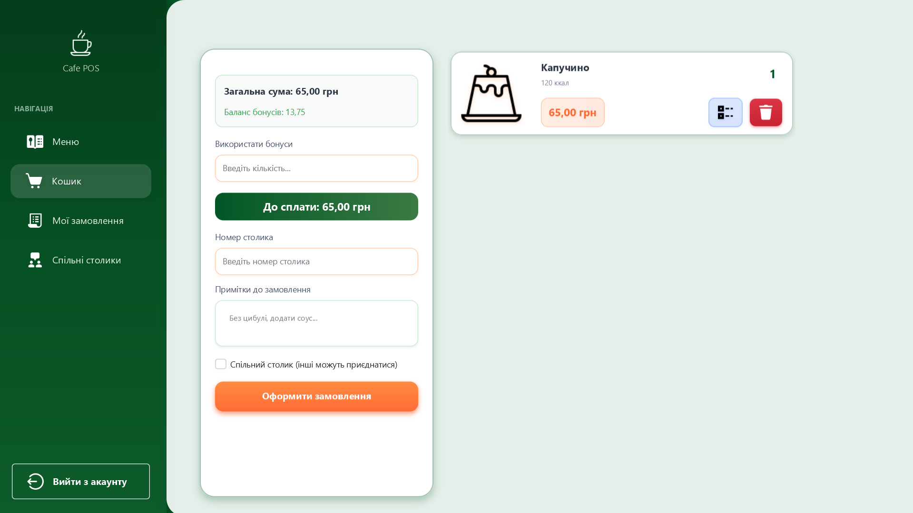 |

| Order Details | Orders List                       | User Management |
|---------------|-----------------------------------|-----------------|
| 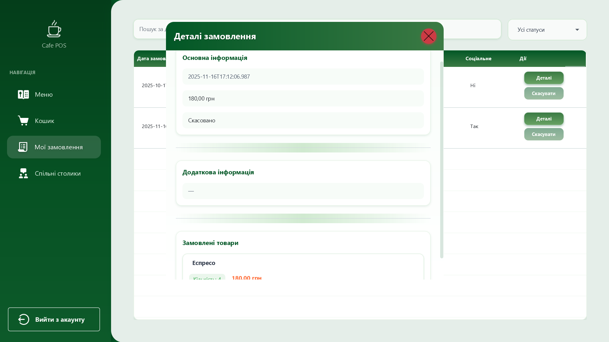 | 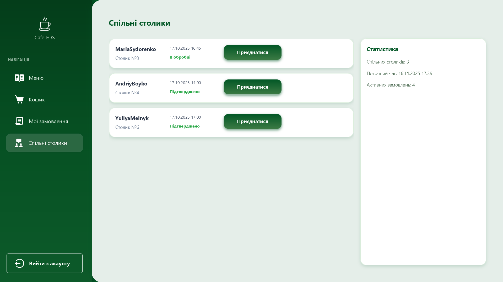 | 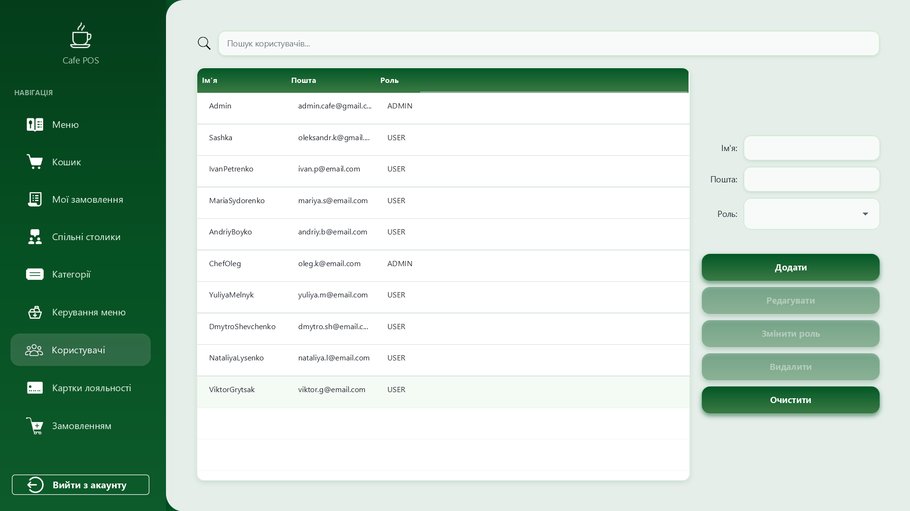 |

| Menu Item Management | Category Management | Loyalty Card Management |
|----------------------|---------------------|-------------------------|
| 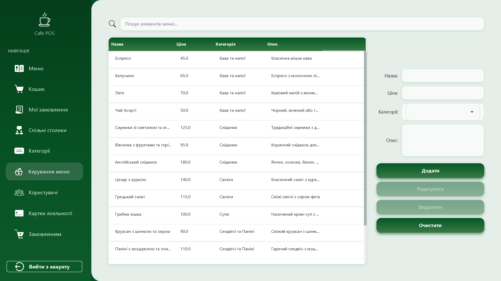 | 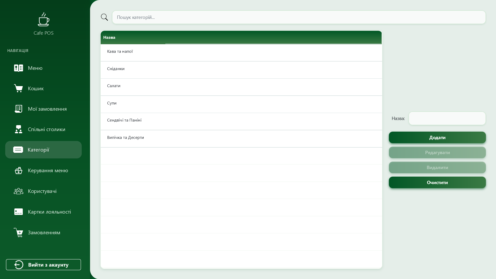 | 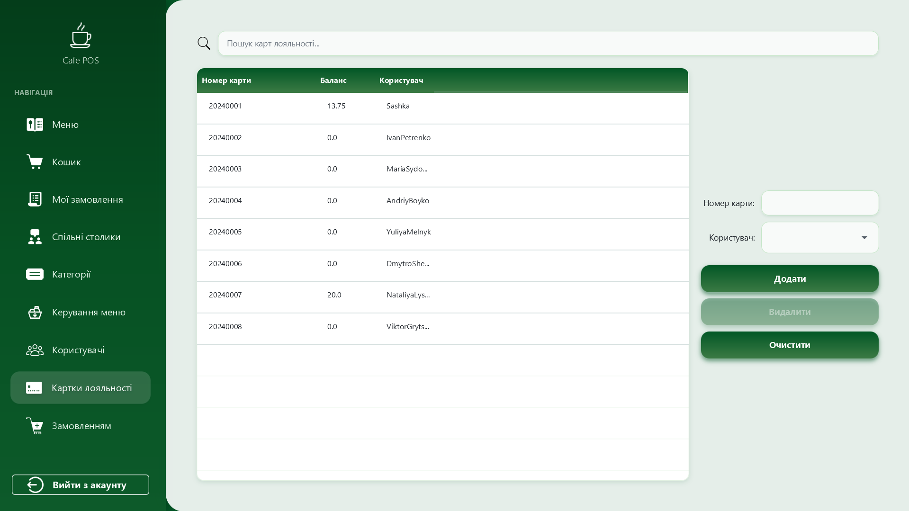 |


## Database Schema

The application uses SQLite with the following main tables:
- `Users` - User accounts and authentication
- `MenuItems` - Cafe menu items with details
- `Categories` - Menu item categories
- `Orders` - Customer orders
- `Cart` - Shopping cart items
- `LoyaltyCards` - Customer loyalty cards
- `BonusTransactions` - Loyalty bonus transactions

## Contributing

1. Fork the repository
2. Create a feature branch (`git checkout -b feature/amazing-feature`)
3. Commit your changes (`git commit -m 'Add some amazing feature'`)
4. Push to the branch (`git push origin feature/amazing-feature`)
5. Open a Pull Request

## License

This project is licensed under the MIT License - see the LICENSE file for details.

## Author

Liamtseva Oleksandra - [GitHub Profile](https://github.com/Sashka11111)
